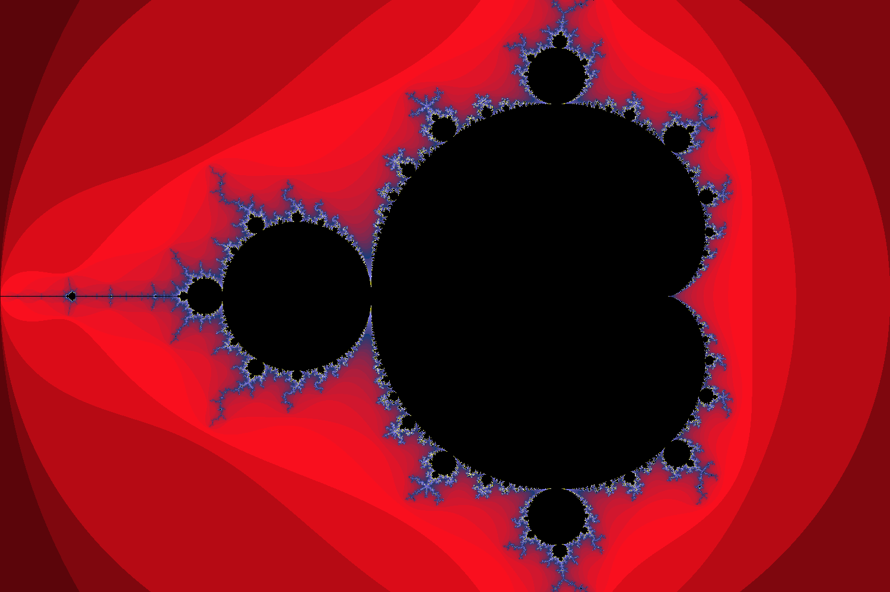

# Fractals
A small Coding Challenge targeted on fractals.  
https://de.wikipedia.org/wiki/Fraktal

Step 1: Implement Mandelbrot-Set Viewer  
Step 2: Visualize Bifurcation and chaos in growing Systems
Goal is to program without looking at other code at all!

### Inspired by:  
Numberphile: https://www.youtube.com/watch?v=NGMRB4O922I  
and  
Veritasium: https://www.youtube.com/watch?v=ovJcsL7vyrk  
Thanks!

### Result:  
Output Mandelbrot Set with Parameters `RES=500` and `MAX_ITERATIONS=100` which leads to an Image the size of 1500x1000px in 53s.  
  
Big Images take much Time. So maybe do an interactive mode and calculate only the Image zoomed to or use a GPU and parallel processing for rendering.